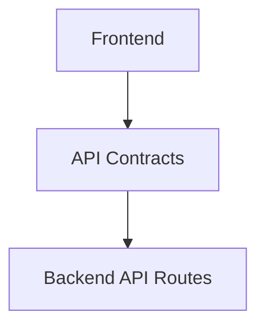

# System Architecture Overview

## Two-Application Architecture

The Skylark BI Agent is a monolithic application conceptually divided into two deployable units: a Next.js frontend and a Python (FastAPI) backend. 
They communicate strictly through a versioned REST API contract (`/api/v1/`).

```mermaid
graph TD
    User([User]) -->|Interacts with| NextJS[Next.js Frontend]
    NextJS -->|REST API /api/v1| FastAPI[FastAPI Backend]
    
    subgraph Backend [Python Backend]
        FastAPI --> AppServices[Application Services]
        AppServices --> Domain[Domain Models]
        AppServices -.->|Coordinates| Agents[Agent Coordinator]
        AppServices -.->|Computes| Analytics[Deterministic Analytics]
        
        Domain <-- Implements --- Infra[Infrastructure]
    end
    
    subgraph External [External Systems]
        Infra --> Monday[monday.com API]
        Infra --> Gemini[Gemini API]
    end
```

## Frontend-Backend Contract


## Dependency Inversion
The backend uses dependency inversion to decouple domain logic from infrastructure adapters.
For example, `Domain` defines a `DealRepository` interface. The `Infrastructure` layer implements `MondayDealRepository`. The `Application` services consume the interface, ensuring business rules and analytics have no dependency on monday.com's specific GraphQL implementation.
